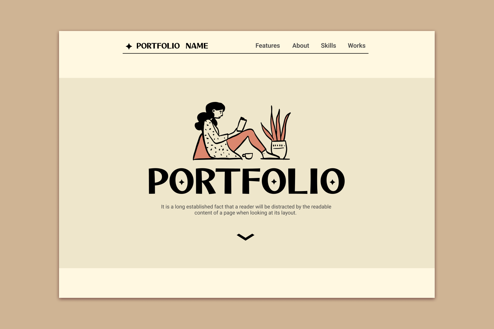
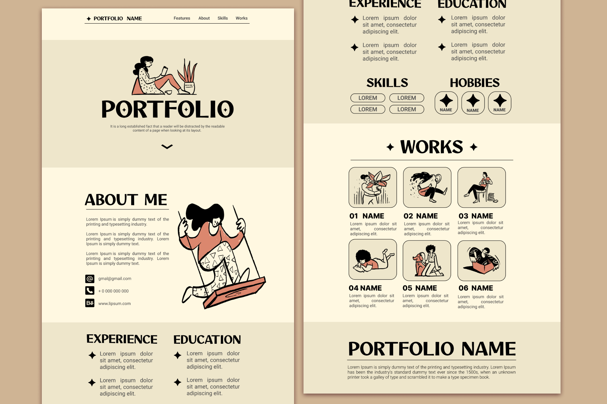

# Portfolio Website Template  

**Portfolio Website Template** is a project aimed at creating a customizable personal portfolio template. It demonstrates a deeper understanding of HTML and CSS and serves as a foundation for future development.  

**Live Preview:** [Click here to view the live demo](https://metaldiavolo.github.io/portfolio-website-template/)  




## Table of Contents

- [Features](#features)
- [Technologies Used](#technologies-used)
- [Features](#features)
- [Future Development Plans](#future-development-plans)
- [Getting Started](#getting-started)
- [Installation](#installation)
- [Contributing](#contributing)

## Technologies Used  
- **HTML5**: Semantic and structural markup.  
- **CSS3**: Styling, layout, and initial design concepts.  

## Features  
- Clean and minimalist design for showcasing portfolio content.
- Modern aesthetic
- Static structure with placeholders for future portfolio content.
- Easy-to-edit HTML and CSS structure

## Future Development Plans  
- **Animations**: Adding smooth transitions and effects for an engaging user experience.
     - [x] base animation
     - [ ] more advanced animation

- **Responsiveness**: Optimizing the website for various devices and screen sizes.
   - [x] desktop
   - [x] mobile
   - [ ] table
         
- **Interactivity**: Enhancing user interaction with features like modal windows, tooltips, and interactive elements.  

## Getting Started

Follow the instructions below to set up the template and customize it for your needs.

### Prerequisites

Make sure you have the following installed:

- [Git](https://git-scm.com/)
- A code editor like [VS Code](https://code.visualstudio.com/)
- A browser for testing (e.g., Chrome, Firefox)

## Installation 
1. Clone the repository:
   ```bash
   git clone https://github.com/metaldiavolo/portfolio-website-template.git
   ```

2. Navigate to the project folder:
   ```bash
   cd portfolio-website-template
   ```

3. Open the project in your preferred editor.

4. Launch the website locally:
   - Open `index.html` in your browser.

## Contributing
Contributions are welcome! If you have suggestions or would like to add features:

1. Fork the repository.
2. Create a new branch for your feature:
   ```bash
   git checkout -b feature-name
   ```
3. Commit your changes:
   ```bash
   git commit -m "Add your message here"
   ```
4. Push to your branch:
   ```bash
   git push origin feature-name
   ```
5. Open a pull request.
